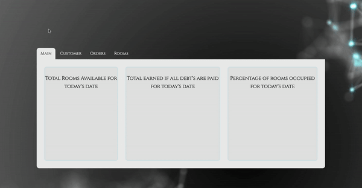

# Outlook Hotel Manager

This is my attempt to create a functioning hotel management tool. Using a premade, fetched, data, I used a number of Object, Array, Number, and String Prototypes to manipulate daid data, then Jquery to display to the DOM, and SCSS for styling.

## Getting Started

1. Clone the repo.
2. Set up the dependancies by running `npm install`
3. Navigate the page!

### Prerequisites

You'll need a modern windows, linux, or OS X machine, able to run the dependancies.

## Running the tests

There are a comprehensive set of mocha/chai tests for all classes, properties, and methods.

Set up the dependancies by running `npm install`

Run tests by typing `npm test` in your terminal in your cloned directory.

### Goals and Objectives

- Follow the specification [here](http://frontend.turing.io/projects/overlook.html) to make a working management tool.
- Implement ES6 classes that communicate to each other as needed.
- Write modular, reusable code that attempts to adhere to the following principles: the Open/Closed Principle, Liskov Substitution Principle, Interface Segregation Principle, Dependency Inversion Principle, and Test Driven Development.
- Implement a robust testing environment using Mocha and Chai.
- Use object and array prototype methods to perform rich data manipulation.
- Display information on the page while maintaining ability to test class properties and methods.
- Create a dash that is easy to follow and displays information in a clear and consice way.

## Author

**Jev Forsberg** - *All work* - [baldm0mma](https://github.com/baldm0mma)

## License

This project is licensed under the MIT License - see the [LICENSE.md](LICENSE.md) file for details.